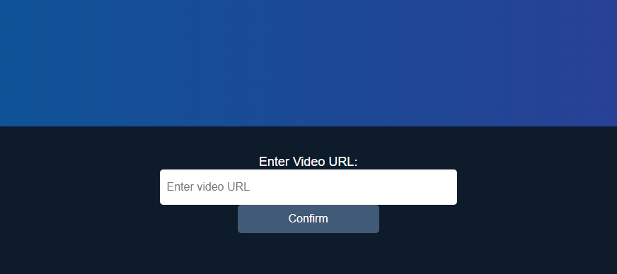

# DeepT: Empowering Video Understanding with AI

 Embark on a journey of enhanced video comprehension with DeepT. This groundbreaking project leverages artificial intelligence (AI) to provide a revolutionary approach to understanding and interpreting video content.

Intelligent Summarization: Through analysis and synthesis of information, DeepT crafts concise yet informative summaries of video content. This enables users to quickly get the essence of a video, saving time and enhancing efficiency.
## Authors

- [@kasperchux](https://www.github.com/kasperchux)

## License

[MIT](https://choosealicense.com/licenses/mit/)

# Installation
- Download Docker from https://www.docker.com/get-started/
- Download Git from https://git-scm.com/downloads
- Install Docker and Git and restart your PC 
- Create empty folder, click right mouse button and open Git Bash in this folder. You should paste in Git Bash next command: 'git clone 'https://github.com/kasperchux/DeepT-Video-Translator.git''
- Now, open CMD (For Windows) or Terminal also in this folder, and paste next command: "docker-compose build"
- Wait until all dependencies are installed
- Paste in terminal 'docker inspect <container_id> | grep "IPAddress"', container id you can find in Docker Desktop. (or docker ps in terminal). You got container_ip
- Open your browser and paste 'http://<container_ip>:5000'.
And now you can use the service

# Example:

Let's say you want to translate some YouTube video. (for instance - 'https://www.youtube.com/shorts/WstkiHTzYCA'). You launch app.py, and open web page.
Below you can see field for a link.

You have pasted your video link, and clicked the button below. Processing has begun, you'll have to wait.

After waiting, your page will refresh. Below you will be able to see 3 text fields

# There are:
- Field with source text, i.e. the whole text of the video in the source (English) language
- Field with translated text, also the whole text of the video, but it's translated to Russian language
- Main idea field, summary. This field contains a brief description of the video, its main idea

But that is not all. Also in the folder called 'frontend' you can find a video that has subtitles, as well as a new voiceover of the translated text

